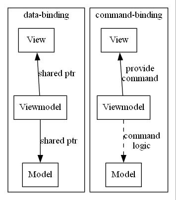
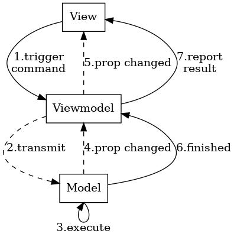

# VBAO

> A lite library aiming for building an MVVM (or MVFM) project.

VBAO这个名字取自《gosick》女主角维多利加的爱称维包子。


## 安装与使用

### Python

在Anaconda Prompt激活要使用的虚拟环境，然后通过pip安装
```shell
conda activate YOURENV
pip install vbao-mvvm
```

安装后即可在Python中使用

```python
import vbao
```

## MVVM简介

MVVM演化于MVC模式，其目的也是为了将控制业务逻辑的Model层和控制用户交互的View层解耦开。

> MVVM 模式中有三个核心组件：模型、视图和视图模型。 每个组件的用途不同。 下图显示了这三个组件之间的关系。
>
> 
>
> 除了要了解每个组件的责任外，了解它们如何交互也很重要。 在较高的层次上，视图“了解”视图模型，视图模型“了解”模型，但模型不知道视图模型，而视图模型不知道视图。 因此，视图模型将视图与模型隔离开来，并允许模型独立于视图进行演变。 -- [MVVM from Microsoft](https://learn.microsoft.com/zh-cn/dotnet/architecture/maui/mvvm)

我们通过数据绑定，指令绑定，属性变化通知实现了MVVM。

<details> <summary>数据绑定，指令绑定，属性变化通知示意图</summary>



data-binding & command-binding


property-change-notification

</details>
<br>

最后，Model和View之间的通信看起来如下图所示：

- View通过指令间接调用Model的功能，Viewmodel可以直接处理指令，或者转发给Model处理
- 如果Model的属性变化了，则通过PropertyNotification通知Viewmodel和View
- Model处理完成，通过CommandNotification告诉Viewmodel和View指令是否成功执行



### 文件树

├── example  
│   ├── app  
│   ├── model  
│   ├── view  
│   ├── viewmodel  
│   └── window  
├── extern  
│   └── pybind11  
├── Lib_VBao  
│   ├── python  
│   │   ├── vbao  
│   └── VBAO  
├── LICENSE  
└── README.md


### Special Thanks

[Zhejiang-University-GKC/SJDXQcourseware: The courseware of SJDXQ (github.com)](https://github.com/Zhejiang-University-GKC/SJDXQcourseware)
