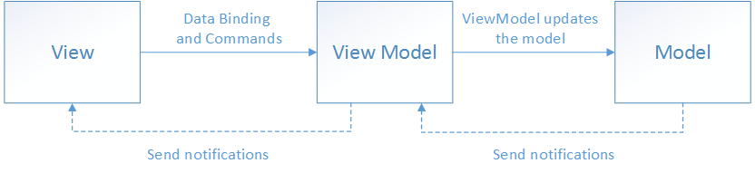

# VBAO

> A lite library aiming for building an MVVM (or MVFM) project.

<center>

[中文ReadMe](README-cn.md)

</center>

## Install and start

### Python

```shell
conda activate YOURENV
pip install vbao-mvvm
```

```python
import vbao
```

## What is MVVM? (briefly)

> There are three core components in the MVVM pattern: the model, the view, and the view model. Each serves a distinct purpose. The diagram below shows the relationships between the three components.
> 
> In addition to understanding the responsibilities of each component, it's also important to understand how they interact. At a high level, the view "knows about" the view model, and the view model "knows about" the model, but the model is unaware of the view model, and the view model is unaware of the view. Therefore, the view model isolates the view from the model, and allows the model to evolve independently of the view. -- [MVVM from Microsoft](https://learn.microsoft.com/en-us/dotnet/architecture/maui/mvvm)

## How does it work?

We implement the data-binding, command-binding and property-change-notification to form an MVVM system.


data-binding & command-binding


property-change-notification

When we make it, the interaction among them is as follows.


## Filetree

├── example  
│   ├── app  
│   ├── model  
│   ├── view  
│   ├── viewmodel  
│   └── window  
├── extern  
│   └── pybind11  
├── Lib_VBao  
│   ├── python  
│   │   ├── vbao  
│   └── VBAO  
├── LICENSE  
└── README.md


## Special Thanks

[Zhejiang-University-GKC/SJDXQcourseware: The courseware of SJDXQ (github.com)](https://github.com/Zhejiang-University-GKC/SJDXQcourseware)
